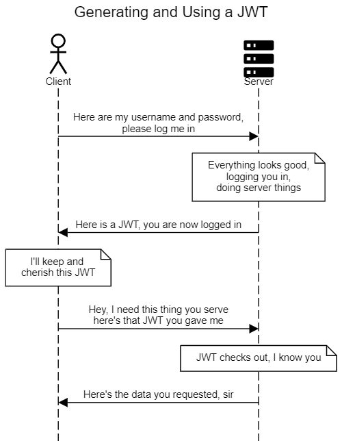

# How to mess up with JWT's - a practitioner's guide

JSON Web Tokens are everywhere - you are using a bunch of them right now. It's such a common technology, yet, it's very easy to get them wrong. In this session, we get to the nitty gritty of JWT's - what they are, how they work, and how to make sure that we haven't made an app that just waits to be hacked. The session's goal is to make developers aware of the pitfalls accompanying JWT's by telling some personal stories of cases where JWT's were used improperly. In my experience, such improper usage is extremely commonplace and JWT's are associated with magical thinking, i.e. "I'm using JWT's and I'm secure" The key take-away of the talk should be that JWT's are a great tool that should be used carefully, with full understanding of what it can and cannot do.

## Slides

[Slides](https://speakerdeck.com/rafalp/you-are-probably-using-jwts-wrong)

## Video

[Video](https://www.youtube.com/watch?v=Z7Wl2FW2TcA)

## What is a JWT?

JWT or JSON Web Tokens (nobody knows how to pronounce the abreviation) are a somewhat-standard way for representing claims securely between two parties. This means that they are often used as a way to authenticate users between a client and a server - we don't really need to send a username and password with every request, we can just send a token that says "I'm logged in as user X" and the server can trust that token.

Let's see a typical scenario where a JWT is used:

```
title Generating and Using a JWT

actor Client
materialdesignicons F048B Server

Client->Server:<align:center>Here are my username and password,\nplease log me in
note over Server:<align:center>Everything looks good,\nlogging you in,\ndoing server things
Server->Client:Here is a JWT, you are now logged in
note over Client: <align:center>I'll keep and \ncherish this JWT

Client->Server:<align:center>Hey, I need this thing you serve\nhere's that JWT you gave me
note over Server: JWT checks out, I know you
Server->Client: Here's the data you requested, sir
```



The JWT is a string that is generated by the server and sent to the client. The client then sends the JWT with every request to the server. The server can then check the JWT and see if it's valid. If it is, the server can trust that the client is who they say they are.
